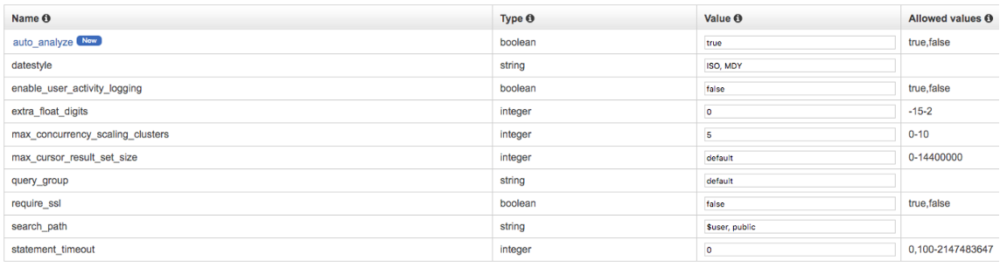
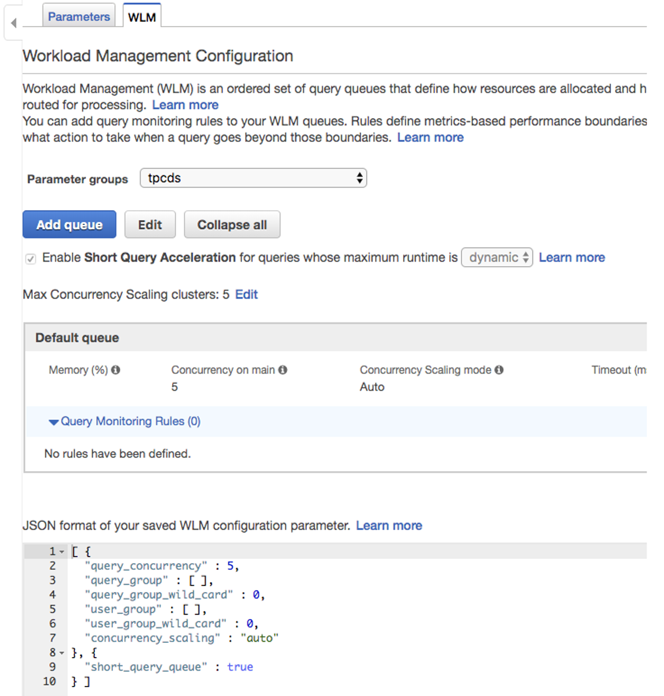

# analytics_at_scale
Code for demonstrating AWS's ability to scale analytics to enterprise volumes (30TB dataset) and use a Lake House architecture to eliminate data silos and empower analysts.

The goal of this exercise is to facilitate demonstrating AWS’s scaling functionality with industry standard benchmarks and datasets. The features we want to demonstrate include:

- Redshift Data Volume Scale - Redshift is a petabyte-scale data warehouse

- Redshift Concurrency Scaling - Effortlessly scale-out query concurrency to meet virtual any number of reporting queries against a data warehouse

- Redshift Spectrum – A Redshift feature that helps eliminate data silos by providing seamless access to Data Lakes

- Athena – Perform serverless adhoc/exploratory analytics directly on Amazon S3 using Standard ANSI SQL

# Setup 
## Setup VPC in us-east-1

- Provision a Redshift cluster of sufficient scale, e.g. 12ra3.4xlarge, name it tpcds
- Provision a ~small EC2 Instance for the query driver, e.g. T2.XL

## Prepare EC2 Instance and Load Redshift

### Upload/SCP load_tpcds.py and run_queries.py to the EC2 instance
#### Install postgres and development libraries so psycopg2 compiles
```
$ sudo yum install -y postgresql postgresql-devel postgresql-libs python3 python3-devel
$ sudo yum groupinstall -y "Development Tools"
```
### Make a virtualenv for Python3 (so we don’t want to stress the Amazon Linux/yum managed Python environment)
- `$ python3 -m venv venv
#### Get into the virtualenv
- `$ source venv/bin/activate`
### Install additional python libraries
- `$ pip3 install sqlparse psycopg2`
### Set environment variables:
```
$ export REDSHIFT_ENDPOINT="tpcds.abcdefghi123.us-east-1.redshift.amazonaws.com"
$ export REDSHIFT_USER="admin"
$ export REDSHIFT_PASS="asdfasdfasdf"
$ export REDSHIFT_IAMROLE="arn:aws:iam::123456789012:role/mySpectrumRole"
```
### Load data
- Run load_tpcds.py. It is recommended to run this in screen, tmux, or nohup.  If the SSH session disconnects the load will not complete; screen, tmux, or nohup will keep the job going.
- `$ nohup python3 ./load_tpcds.py all`

## Setup Glue Data Catalog

- Crawl s3://jwyant-tpcds/processed/30tb
-	Modify in table store_sales ss_sold_date_sk from string/char to int in Data Catalog

## Setup Redshift Spectrum

### Create IAM Role for Spectrum with appropriate access
- 	https://docs.aws.amazon.com/redshift/latest/dg/c-getting-started-using-spectrum-create-role.html
###	Create Spectrum Schema on your newly crawled Glue Data Catalog Schema
```
CREATE EXTERNAL SCHEMA spectrum_tpcds
FROM DATA CATALOG
DATABASE 'tpcds'
IAM_ROLE 'arn:aws:iam::123456789012:role/mySpectrumRole'
CREATE EXTERNAL DATABASE IF NOT EXISTS;
```
###	Run this to set the rownumbers in the schema so the optimizer has more information
-	`$ python ./load_tpcds.py setnumrows tpcds`

## Update the settings in Redshift WLM 
### Set max_concurrency_scaling_clusters > 0 (image below)



### Set concurrency_scaling mode to "auto" (image below)


Ready to go!  Use demo_script.sql for the sample queries.  Use run_queries.py for demonstrating concurrency scaling.  Please ensure you're in your virtualenv and have the right dependencies.

```
$ python ./run_queries.py [1-???] “custom query group”
```

Happy Analytics!
